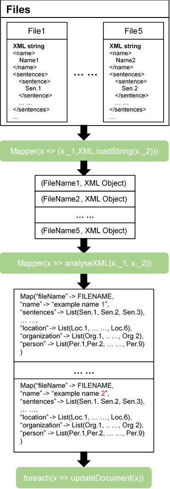
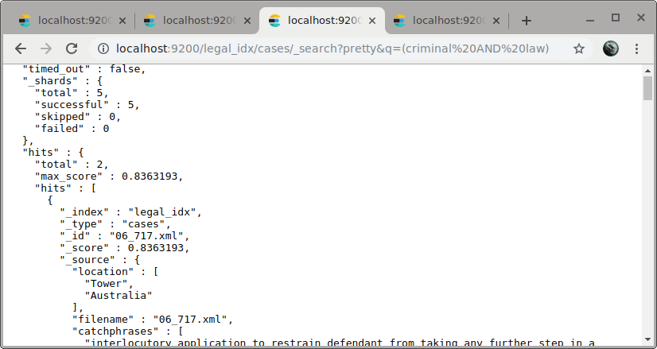
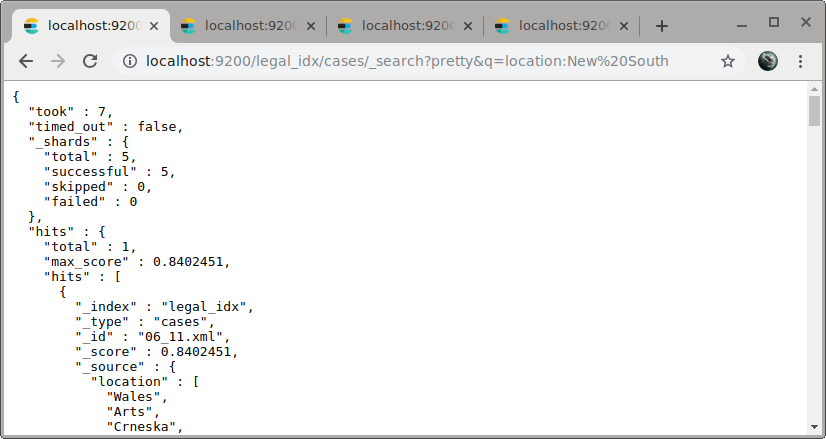
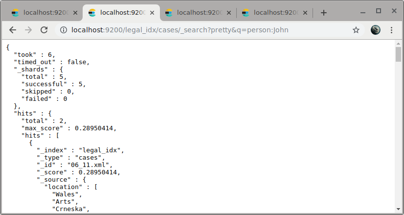
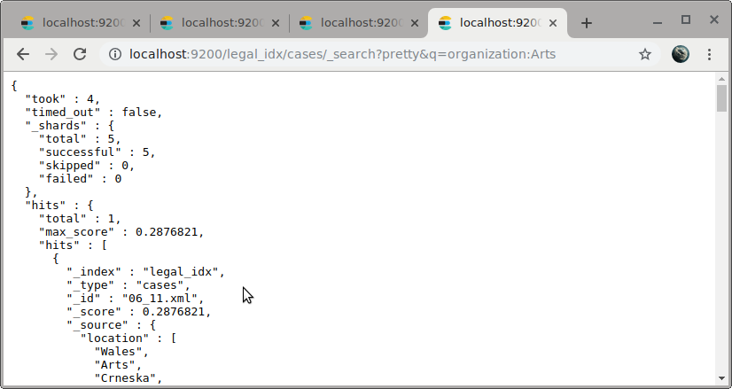

# Data Curation And Indexing with ElasticSearch

## Solution

In this assignment, I use scalaj-http for handling HTTP, scala-xml for handling XML, and JSON4S for handling JSON.

Run ‘spark-submit’ with ‘--packages --packages "org.scalaj:scalaj-http_2.11:2.4.2","org.json4s:json4s-native_2.11:3.5.3"’

Firstly, get the RDD of all files via method named ‘wholeTextFiles’

Secondly, convert every file from string to XML object.

Then, we get an array contains key-value pairs whose value is the XML object.

Thirdly, analyse each XML object via analyseXML method. This method will split XML object to XML elements and send each of them to NLP server for getting named entity recognition.

After that, we get several map objects, containing filename, sentences and NERs, which will be sent to Elasticsearch server.

Finally, the Map object will be converted to JSON string in updateDocument and be sent to Elasticsearch server.



## Index design

| filename | Text | Filename, where the document from |
| --- | --- | --- |
| name | Text | Name of case |
| AustLII | Text | URL of this case |
| catchphrases | Text(List) | Summarize of case stored in text list |
| sentences | Text(List) | Sentences contained in the legal case report and stored in text list |
| person | Text(List) | Store person NER analysed from XML |
| location | Text(List) | Store location NER analysed from XML |
| organization | Text(List) | Store organization NER analysed from XML |

## Example queries

Query based on general terms:

```bash
curl -X GET \
"http://localhost:9200/legal_idx/cases/_search?pretty&q=(criminal%20AND%20law)"
```



Queries based on entity type:

```bash
curl -X GET \
"http://localhost:9200/legal_idx/cases/_search?pretty&q=location:New%20South%20Walse"

curl -X GET \
"http://localhost:9200/legal_idx/cases/_search?pretty&q=person:John"

curl -X GET \
"http://localhost:9200/legal_idx/cases/_search?pretty&q=organization:Arts"
```







